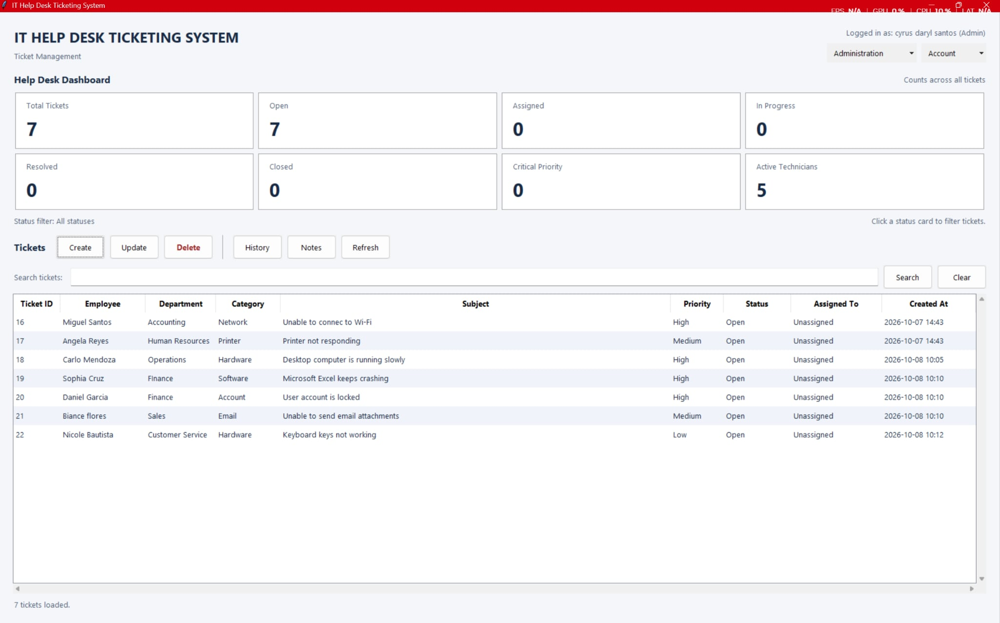

# IT Help Desk Ticketing System

A Python + MySQL based IT Help Desk Ticketing System.

## Screenshots

### Dashboard



### Create a Ticket


### Update a Ticket


### Ticket Notes


### User Management


### Change User Status


### Reports and Excel Export


## Windows executable

See [DEPLOYMENT.md](DEPLOYMENT.md) for building `ITHelpDesk.exe`, configuring its
external `.env`, and deploying with a local or central MySQL database.

## Project Status

🚧 In Development

## Technologies

- Python
- MySQL
- Git
- GitHub

## Features

- [ ] Create tickets
- [ ] View tickets
- [ ] Search tickets
- [ ] Update tickets
- [ ] Assign tickets
- [ ] Ticket status
- [ ] Dashboard
- [ ] User authentication
- [ ] Reports

## Technician Management

From the project directory in Git Bash, use the existing `.env` connection settings
with `DB_NAME=helpdesk` and run this setup command once:

```bash
python setup_technicians.py
```

The database user needs CREATE permission on `helpdesk` for setup. This command
creates only `helpdesk.technicians`; it leaves existing tables unchanged and is
safe to rerun. It uses MySQL-generated IDs and timestamps, defaults new technicians
to `Active`, and enforces unique email addresses without regard to letter case.
Normal CLI use requires SELECT, INSERT, and UPDATE permission on the technician table.

```bash
python app.py
```

Choose **6. Manage Technicians**, then **1. View Technicians** or **2. Add Technician**.
Choose **3. Change Technician Status** to activate or deactivate a technician.
Choose **4. Back** to return to the main menu, or **9. Exit** from the main menu.
Full names and emails are required, with limits of 100 and 150 characters.

Manual checks:

1. View Technicians before adding anyone: expect a friendly empty-list message.
2. Add `Alex Reyes` with `alex.reyes@example.com`: expect the new technician ID.
3. View Technicians: confirm the ID, full name, email, and `Active` status.
4. Add the same email again, including with different letter case: expect a
   friendly duplicate-email message and no additional technician.
5. Try blank or whitespace-only names/emails and inputs exceeding their limits:
   expect a validation message and another prompt.
6. Enter an invalid submenu option, then Back: confirm friendly handling and return
   to the main menu. Verify the existing ticket options still work as before.

Run automated tests without connecting to a live database:

```bash
python -m unittest discover -s tests -v
```

## Assign a Technician to a Ticket

Choose **4. Update Ticket**, enter the ticket ID, and continue to **Assigned To**.
The prompt lists only active technicians. Select a list number to assign that
technician, press Enter to keep the current assignment, or enter `0` to unassign.
Invalid selections are rejected. If none are active, keeping or removing the
current assignment remains available.

Review the proposed changes and confirm saving as usual. Selecting a technician
for an Open ticket changes its status to Assigned unless you explicitly choose
another status. Other current statuses are preserved unless you edit Status.
Unassigning leaves the status unchanged unless you edit it. The repository
rechecks that the selected technician exists and is Active before saving their
name into the existing `assigned_to` field. No schema migration is required.

## Change Technician Status

Choose **6. Manage Technicians → 3. Change Technician Status**. The CLI displays
all technicians with their IDs, full names, emails, and current statuses. Enter
a Technician ID, choose `Active` or `Inactive`, then confirm the proposed change
with `y` or `yes`. Other confirmation responses cancel. An unchanged status does
not trigger a database update. Invalid IDs, missing technicians, and database
errors produce friendly messages.

Inactive technicians remain visible in View Technicians, and existing assigned
tickets keep displaying their names. Only active technicians appear in ticket
assignment choices. Reactivating a technician makes them available again.
Status changes update only the technician row; no schema migration is required.

Manual checks:

1. Assign an active technician to a test ticket and confirm that their name appears.
2. Change that technician to Inactive and confirm. View Technicians should still
   show the same ID, name, and email, now with status Inactive.
3. View/search the assigned ticket: the technician's name should remain. Open
   Update Ticket: the technician should be absent from assignment choices, and
   Enter should still keep the existing assignment.
4. Reactivate the same technician and confirm. They should reappear in assignment
   choices without changing existing assigned tickets.
5. Try `abc`, `0`, and a nonexistent ID; expect friendly messages. Try an invalid
   status; expect another prompt. Cancel a valid change; verify the status stays.

## Ticket Activity History

From the project directory in Git Bash, run this repeatable setup command using
the existing `.env` with `DB_NAME=helpdesk`:

```bash
python setup_ticket_history.py
python app.py
```

Setup creates only `helpdesk.ticket_history`, including a foreign key to tickets.
The account needs CREATE and REFERENCES permission for setup, plus SELECT and
INSERT on the history table for normal use. Existing tickets are left unchanged;
past activity is not backfilled. Set up history before creating or updating tickets.

If setup reports a permission error, use a MySQL administrator account to run
the same reviewed SQL file. With the local MySQL 8.0 installation in Git Bash:

```bash
"/c/Program Files/MySQL/MySQL Server 8.0/bin/mysql.exe" -h 127.0.0.1 -P 3306 -u root -p helpdesk < database/ticket_history.sql
```

Enter the administrator password when prompted; the command does not store it.

Choose **7. View Ticket History**, enter a Ticket ID, and view activity oldest
first. The main menu's Exit option is now **9**. Creation records actual priority
and status defaults. Updates record status, priority, assignment/reassignment/
unassignment, and changes to employee name, department, category, subject, or
description. Long text is shortened in history details; the ticket text stays intact.

Activity is saved in the same transaction as the ticket change. Failed saves,
cancelled updates, and unchanged values produce no activity. History reads do not
modify data. The foreign key uses `ON DELETE CASCADE`: deleting a ticket also
removes its history, preserving the existing Delete Ticket behavior.

Manual checks:

1. Create a test ticket, note its ID, then choose View Ticket History: expect a
   Ticket Created row containing its priority and status.
2. Change its status and priority, confirm, and view history: expect old/new values.
3. Assign an active technician, then another technician, then unassign: expect
   Technician Assigned, Technician Reassigned, and Technician Unassigned rows.
4. Change a subject or description: expect Ticket Information Updated details.
5. Keep all fields with Enter or cancel an update: history must remain unchanged.
6. Try an invalid/nonexistent ID; expect friendly messages. A pre-existing ticket
   with no new activity should show a friendly empty-history message.
7. Delete the test ticket with the existing confirmation flow: deletion should
   succeed, and View Ticket History should report that the ticket does not exist.

## Ticket Comments / Notes

From the project directory in Git Bash, using the existing `.env` with
`DB_NAME=helpdesk`, run:

```bash
python setup_ticket_comments.py
python app.py
```

Setup creates only `helpdesk.ticket_comments` and is safe to rerun. It leaves
tickets, technicians, and history unchanged. The setup account needs CREATE
permission and REFERENCES permission on tickets and technicians. Normal use needs
SELECT, INSERT, and DELETE on comments, plus the existing ticket/technician permissions.
If setup reports insufficient permissions, run the same SQL with a local MySQL
administrator account, entering the password when prompted:

```bash
"/c/Program Files/MySQL/MySQL Server 8.0/bin/mysql.exe" -h 127.0.0.1 -P 3306 -u root -p helpdesk < database/ticket_comments.sql
```

Choose **8. Ticket Comments / Notes**. Its submenu contains **1. View Ticket Notes**,
**2. Add Ticket Note**, **3. Delete Ticket Note**, and **4. Back**. Main-menu options 1 through 7 retain their
existing behavior, and **9. Exit** closes the program.

Add Ticket Note verifies a numeric Ticket ID and shows a short ticket summary.
Select the note's author by number from the active-technician list, then enter
the note. Leading/trailing spaces are trimmed, and at least three letters or
numbers are required; spaces and punctuation do not count toward that minimum.
Numeric notes such as `404` remain valid. Notes exceeding MySQL TEXT's 65535-byte
UTF-8 capacity are rejected. The repository rechecks ticket existence and active
author status before saving the technician ID and note in one transaction.

View Ticket Notes shows date/time, technician name, and note text from oldest
to newest, with the comment ID breaking timestamp ties. Inactive authors' names
remain visible. A missing author displays as `Unknown technician`. Notes do not
change ticket status or write automatic history. The ticket foreign key uses
`ON DELETE CASCADE`, so existing ticket deletion removes its notes; the technician
foreign key uses `ON DELETE SET NULL` to retain notes if an author is ever removed.
Delete Ticket Note asks for the Ticket ID first, verifies it exists, then shows
that ticket's notes with Comment IDs, technician names, timestamps, and text.
Enter one Comment ID to preview the selected note again. Only uppercase `Y` or
`YES` confirms permanent deletion; any other response cancels. Both IDs are
rechecked in the deletion transaction, and only one matching note can be deleted.
Missing notes and database errors produce friendly messages. Deleting a note
does not change ticket status or automatic history. This feature requires no
schema changes. Comment editing is not available.

Manual checks (use a test ticket):

1. Run setup twice; both runs should succeed without changing existing data.
2. Choose **8 → 1** for a ticket without notes; expect a friendly empty message.
3. Choose **8 → 2**, enter the ticket ID, and select an active technician. Add
   `  Checked network cable and restarted the router. Connection is stable now.  `.
   Expect success; **8 → 1** should show the trimmed note, author, and timestamp.
4. Add a second note and view again; verify oldest-to-newest ordering. Check
   View Tickets and View Ticket History: status and history should be unchanged.
5. Change the author to Inactive through **6 → 3**. Existing notes should still
   display their name, while Add Ticket Note should omit them from its choices.
   Reactivate them and verify that they appear again.
6. Try Ticket IDs `abc`, `0`, and a nonexistent positive ID in both note actions.
   Expect friendly messages. Try blank, `0`, text, and an out-of-range technician
   choice; expect another selection prompt. If no technicians are Active, expect
   a friendly message and no saved note.
7. Try blank, whitespace-only, `ab`, `a b`, and `!!!` notes; expect validation and
   another prompt. Try `PC 3` and `Error 404`; both should be accepted.
8. Delete the disposable test ticket using **5** and the existing explicit
   confirmation. Deletion should succeed despite its notes; both notes and
   history should then report that the ticket does not exist.
9. Check the other ticket and technician menus, submenu Back, invalid menu inputs,
   and **9. Exit**. Run the automated regression suite:

   ```bash
   python -m unittest discover -s tests -v
   ```

Delete Ticket Note checks (use disposable notes):

1. Add at least two notes to a test ticket and one to a second ticket. Choose
   **8 → 3**, enter the first ticket's ID, and check the displayed Comment IDs,
   authors, timestamps, and text.
2. Enter one displayed Comment ID. Confirm that its details appear again before
   the confirmation prompt. Enter `N`, Enter, `y`, or another response; expect
   cancellation and all notes to remain.
3. Repeat with `Y` or `YES`; expect success. View Ticket Notes and verify that
   only the selected note disappeared. Ticket status and history must be unchanged.
4. Try Ticket IDs `abc`, `0`, or a nonexistent ID, and Comment IDs `abc`, `0`,
   an unknown ID, or the second ticket's Comment ID. Expect friendly messages and
   no deletion. A ticket with no notes should return without asking for a Comment ID.
5. Try a note from an inactive technician; it should still display and be deletable
   after confirmation. Check **4. Back**, existing View/Add options, and **9. Exit**.

## GUI Foundation / View Tickets

From the project directory in Git Bash, launch the separate Tkinter application:

```bash
.venv/Scripts/python.exe gui_app.py
```

With your Python environment already active, `python gui_app.py` also works.
The GUI now opens the Login screen first. With the users table already set up,
use Create Account to create the first Admin or authorize another account with
an existing Active Admin. The administrator CLI fallback remains available.
Tkinter and ttk are included with the project's Windows Python installation;
no additional GUI package or database migration is needed. The viewer uses the
existing `.env` settings and accepts only `DB_NAME=helpdesk` through the shared
database connection function.

The resizable 1240 × 840 window displays Ticket ID, Employee, Department, Category,
Subject, Priority, Status, Assigned To, and Created At. It loads tickets on startup.
Use Refresh to reload from MySQL, the scrollbars to browse larger tables, and click
one row to select it. Database reads run in a background thread so the window
remains responsive. Failed refreshes show a friendly status message and retain
the last successful rows. The GUI supports viewing, creating, searching, updating,
and deleting tickets, plus technician management, ticket history, ticket notes,
and a Help Desk dashboard. The
existing CLI remains available with `python app.py`.

Manual checks:

1. Launch the GUI and check its title, header, columns, and loaded-ticket message.
2. Resize the window, scroll in both directions, and select a single ticket row.
3. Make a test ticket change through the existing CLI, then click Refresh in the
   GUI. Verify that the table updates without restarting and rows are not duplicated.
4. If the database contains no tickets, expect `No tickets found.` Do not delete
   existing tickets merely to test the empty state; it is covered automatically.
5. With MySQL temporarily unavailable, Refresh should show `Unable to load tickets.`
   with connection guidance, retain existing rows, and remain responsive. Restore
   MySQL and click Refresh again; loading should recover.
6. Close the window, then check the existing CLI still works. Run the automated
   tests, which require neither an interactive GUI nor a live database:

   ```bash
   .venv/Scripts/python.exe -m unittest discover -s tests -v
   ```

## Create Ticket in the GUI

Click **Create Ticket** next to Refresh. The dialog contains Employee Name,
Department, Category, Subject, a multiline Description, and Priority. Category
and Priority use readonly dropdowns with the same choices as the CLI; Priority
defaults to Medium. The shared validation trims text and enforces the existing
name, length, and database-capacity rules. Validation and database errors keep
the form open with a friendly message and preserve entered values.

Save uses the existing repository, including its generated defaults and automatic
Ticket Created history entry. A successful save closes the form, displays the new
Ticket ID, and automatically refreshes the main table. If a table load is already
running, another refresh follows it so the new ticket appears. Cancel, Escape, or
the dialog's close button discards an unsaved form. Only one Create Ticket dialog
opens at a time. During saving, inputs and Save/Cancel are disabled, and closing
waits for the save result to prevent duplicate or uncertain submissions. No schema
change or additional dependency is required.

Manual checks:

1. Launch `.venv/Scripts/python.exe gui_app.py`, click Create Ticket, and check all
   six fields, readonly dropdowns, multiline Description, and Medium priority.
2. Save a blank form. Try Employee Name `3`, Department `!!!`, Subject `ab`, and
   Description `1234`, correcting each earlier invalid field before the next check.
   Each invalid save should show a friendly message, keep values, and leave the
   form open. Overlong names or subjects should also be rejected.
3. Create a test ticket with Employee Name `  Alice Reyes  `, Department `  IT  `,
   Category Hardware, Subject `  PC 3  `, a description containing two lines, and
   Priority Medium. Save once; expect a message containing the new Ticket ID, the
   dialog to close, and the ticket to appear automatically in the table.
4. Use the existing CLI to inspect that Ticket ID. Verify trimmed text, multiline
   description, Open status, generated timestamps, and one Ticket Created history
   entry. Check other priority/category choices using another disposable test ticket.
5. Enter data in a new form and Cancel. Reopen and close with Escape or the window
   close button. None of those actions should save a ticket. Repeated requests to
   open Create Ticket should reuse the existing dialog.
6. With MySQL temporarily unavailable, Save a valid form. Expect a friendly error
   and retained inputs. Restore MySQL and retry; expect normal success. While a
   save is running, Save/Cancel must stay disabled.
7. Verify manual Refresh, row selection, scrolling, and existing CLI menus still
   work, then run `.venv/Scripts/python.exe -m unittest discover -s tests -v`.

## Search Tickets in the GUI

Use the search box above the existing ticket table, then click **Search** or press
Enter while the box is focused. The existing repository performs a case-insensitive
substring search across Ticket ID, Employee Name, Department, Category, Subject,
Priority, Status, and Assigned Technician. Leading/trailing spaces are trimmed,
and numeric searches such as `3` remain valid. SQL values stay parameterized; `%`,
`_`, and `!` are treated literally rather than as user-supplied SQL wildcards.

Matching rows replace the contents of the same table, including Created At. An
empty result clears the rows and shows `No matching tickets found.` **Clear Search**
empties the search box and restores all tickets. Submitting a blank/whitespace-only
search also restores all tickets.

**Refresh reruns the last submitted search.** Editing the box alone does not change
the active filter until Search or Enter is used. Clear Search removes that filter.
Create Ticket also refreshes the active filter: a newly created matching ticket
appears automatically; use Clear Search to see one that does not match. Database
errors retain the last successfully loaded rows with a friendly error message.
Reads remain in the background, and a newer search replaces a pending request so
older results cannot overwrite it. No schema changes are required.

Manual checks:

1. Launch `.venv/Scripts/python.exe gui_app.py`. Search for a known Ticket ID,
   including `3` when appropriate, and confirm numeric input is accepted.
2. Search for known employee, department, category, subject, priority, status,
   and technician text. Repeat a known term in uppercase/lowercase; matching
   results should be the same. Created At should remain visible.
3. Search `  Hardware  ` and confirm trimming. Type a term in the focused box and
   press Enter; expect the same result as clicking Search.
4. Search a term absent from your tickets; expect an empty table and
   `No matching tickets found.` Then Clear Search; expect an empty box and all
   tickets restored. A whitespace-only search should also restore all tickets.
5. Search a known category, then Refresh; the filter should stay active. Edit
   the box without submitting and Refresh again; the previous filter should still
   apply. Submit the edited term to apply it.
6. Quickly submit different searches or Clear Search during a load. The final
   table should follow the latest request without duplicate rows or a frozen GUI.
7. Create a test ticket matching the active search; it should appear automatically
   after saving. Create one that does not match; Clear Search should reveal it.
8. With MySQL temporarily unavailable, Search should show a friendly error and
   preserve previous rows. Restore MySQL, then Search, Refresh, or Clear Search;
   the GUI should recover. Check row selection, scrolling, and the existing CLI.
9. Run `.venv/Scripts/python.exe -m unittest discover -s tests -v`.

## Update Ticket in the GUI

Select one row in the existing table, then click **Update Ticket** beside Create
Ticket and Refresh. With no selection, a friendly message asks you to select a
ticket. The dialog loads fresh, complete ticket details and Active technicians
through the existing repositories in a background thread. Ticket ID and created,
updated, and resolved timestamps are displayed as information rather than inputs.

Edit Employee Name, Department, Category, Subject, multiline Description, Priority,
Status, and Assigned Technician. Category, Priority, Status, and technician choices
are readonly dropdowns. Text uses the shared CLI/repository validation and is
trimmed before saving; blank or invalid values keep the form open with feedback.
Leaving prefilled values untouched keeps them. Technician choices show names and
IDs to distinguish duplicate names. **Keep current** preserves the existing name,
including an inactive or legacy assignment; **Unassign technician** removes it.
Only Active technicians are offered for new assignments. If none are available,
other edits, keeping the assignment, and unassigning remain possible.

**Save Changes** asks for confirmation before using the existing update transaction.
Assigning an active technician changes an Open ticket to Assigned when its requested
status is still Open; other statuses and explicit status changes are preserved.
Entering Resolved sets the resolution timestamp, remaining Resolved preserves it,
and leaving Resolved clears it, exactly as in the CLI. Automatic history logging
remains in that transaction, and unchanged values generate no activity. The selected
technician's Active status is rechecked at save time.

Success closes the dialog, shows the Ticket ID, and refreshes the existing table.
**The last submitted search filter stays active.** A ticket that no longer matches
disappears from the filtered results; Clear Search restores the full list. A save
during a table load queues another refresh. Database errors retain form values and
allow retrying. Cancel, Escape, and the close button discard unsaved edits; during a
save, controls are disabled and closing waits for the result. One editing/creation
dialog is open at a time. No database migration or extra dependency is required.

Manual checks (use disposable test tickets):

1. In Git Bash, run `.venv/Scripts/python.exe gui_app.py`. Click Update Ticket with
   no selected row; expect a friendly message and no dialog or database update.
2. Select a ticket and click Update Ticket. Verify that all eight editable fields,
   the full description, current assignment, and read-only timestamps are shown.
   Category, Priority, Status, and Assigned Technician must be readonly dropdowns.
3. Save unchanged values; expect `No changes made.` Try Employee Name `3`, Department
   `!!!`, Subject `ab`, Description `1234`, and blank/whitespace text, correcting each
   earlier invalid field before checking the next. No invalid save should occur.
4. Edit Subject to `  Error 404  ` and Description to a valid multiline value. Click
   Save Changes, decline confirmation, and verify the form stays open and nothing
   changed. Save again and confirm; expect success, a closed dialog, and refreshed
   rows. Reopen to check trimming and the preserved multiline description.
5. On an Open test ticket, select an Active technician and confirm. Verify the name
   and Assigned status. On In Progress, Resolved, and Closed test tickets, change
   the technician and verify those statuses remain unchanged. Explicitly choose
   In Progress on an Open ticket while assigning; In Progress must be preserved.
6. Choose Keep current, edit another field, and verify the assignment remains.
   Choose Unassign technician and verify the assignment clears without changing
   status. Existing inactive assignments must remain visible in Keep current while
   inactive technicians are absent from the new-assignment choices. With no Active
   technicians, expect friendly feedback and working keep/unassign/other edits.
7. Change a test ticket to Resolved, then use the CLI to inspect its resolved_at.
   Edit its priority while keeping Resolved; the timestamp must stay the same.
   Reopen it as Open or In Progress; resolved_at must clear. Use CLI option 7 to
   check history for status, priority, assignment/reassignment/unassignment, and
   information updates. Unchanged or cancelled edits must create no activity.
8. Search for a category, update a matching test ticket to another category, and
   confirm the filter stays active and the ticket disappears. Clear Search to see
   it again. Check Create Ticket, Refresh, scrolling, selection, and CLI menus.
9. Open a test ticket, temporarily make MySQL unavailable, and confirm a valid
   update. Expect a friendly error and retained values. Restore MySQL and retry.
   A ticket deleted or technician made Inactive through the CLI after opening the
   dialog must produce friendly save feedback rather than a crash.
10. Run `.venv/Scripts/python.exe -m unittest discover -s tests -v`. Tests use mocks
    and require neither an interactive GUI session nor a live database.

## Delete Ticket in the GUI

Select one ticket row, then click **Delete Ticket** beside Update Ticket. With no
selection, a friendly message asks you to select one ticket; no deletion is attempted.
The confirmation window loads fresh ticket information through the existing
repository and displays Ticket ID, Employee Name, Subject, Status, and Assigned
Technician, including existing inactive assignments. It clearly warns that deletion
is permanent and removes that ticket's activity history and notes.

**Opening the window does not delete anything.** Cancel is focused by default.
Cancel, Escape, or the window's close button dismisses the preview without changing
the ticket. Only clicking **Permanently Delete** confirms deletion. That button is
disabled until current ticket details load, and both buttons are disabled during
deletion to prevent repeated requests or hiding a pending result. Closing the main
window waits for any pending deletion. Only one create/update/delete dialog opens
at a time.

Reads and deletion run in background threads. The existing `delete_ticket` repository
function rechecks and locks the selected ID, deletes at most one ticket with
parameterized SQL, and commits or rolls back using its existing safeguards. The
GUI contains no DELETE SQL and does not delete notes/history separately; the
existing foreign keys handle their `ON DELETE CASCADE` relationships. No schema
change, setup command, or extra dependency is required.

A successful deletion closes the dialog, shows a success message, immediately
removes the selected row, and refreshes the existing table. **The last submitted
search filter stays active.** Other matching tickets remain visible; deleting the
last match produces `No matching tickets found.` Clear Search restores the full
remaining list. If a table load is already running, its older result is discarded
and a new refresh follows so it cannot restore the deleted ticket. Even if the
follow-up refresh fails, the confirmed deleted row remains removed.

Missing tickets produce friendly feedback and refresh the table without reporting
deletion success. Database errors leave the confirmation window open, restore its
buttons, and show guidance. If deletion cannot be confirmed, Cancel and use Refresh
to check the ticket before deciding whether to retry. Existing ticket creation,
updates, search, assignment, CLI history, and CLI notes behavior are unchanged.

Manual checks (delete only disposable test tickets):

1. In Git Bash, launch `.venv/Scripts/python.exe gui_app.py`. Without selecting a
   row, click Delete Ticket; expect a friendly selection message and no deletion.
2. Select a test ticket and click Delete Ticket. Check the fresh Ticket ID, employee,
   subject, status, assigned technician, and warning that deletion is permanent.
   Cancel should have focus; loading the preview must not delete the ticket.
3. Click Cancel and verify the ticket still appears after Refresh. Reopen and test
   Escape and the dialog's close button; both must also leave the ticket unchanged.
4. Reopen the confirmation for the same test ticket and click Permanently Delete.
   Expect a success message containing its ID, a closed dialog, immediate removal
   of that row, and a refreshed table. Other tickets and technicians must remain.
5. Search for a test ticket by its ID or subject, delete it, and verify the active
   search remains. Other matches should stay visible; no remaining matches should
   show the friendly empty result. Clear Search should show all remaining tickets.
6. Create another disposable ticket and add a note through CLI option 8. Confirm
   it has history through CLI option 7, then delete it in the GUI. The deletion
   should succeed without foreign-key errors; CLI ticket/history/notes lookups for
   its ID should say the ticket does not exist. Its technician must remain.
7. Open a disposable ticket's confirmation, then delete that ticket through the
   CLI before clicking Permanently Delete in the GUI. Expect Ticket Not Found and
   a refreshed table, with no false success or crash.
8. Open a confirmation, temporarily make MySQL unavailable, and click Permanently
   Delete. Expect friendly feedback and usable Cancel after the failed request.
   Restore MySQL, Cancel, and Refresh to check the ticket before retrying. With
   MySQL unavailable when opening the preview, deletion must remain disabled.
9. Verify View, Refresh, Create, Search, Update, and CLI menus still work. Repeated
   attempts to open Delete Ticket must reuse the same confirmation, and repeated
   confirmation clicks while deleting must not start additional deletions.
10. Run `.venv/Scripts/python.exe -m unittest discover -s tests -v`. Automated checks
    use mocks and require neither an interactive GUI nor live database changes.

## Technician Management in the GUI

Click **Manage Technicians** in the main window's header to open the separate
Technician Management window. Its resizable table shows Technician ID, Full Name,
Email, Status, and Created At, with single-row selection and both scrollbars. It
loads all technicians, including Inactive ones. **Refresh** reloads the table;
an empty list shows friendly feedback. Database errors preserve previously loaded
rows and leave Refresh available for recovery.

**Add Technician** opens a small Full Name/Email form. It reuses shared validation
and the existing repository: text is trimmed, blank values are rejected, names
require at least one alphabetic letter, and existing field-length limits apply.
Duplicate emails are prevented by the existing database UNIQUE constraint and
shown as friendly feedback without closing the form. MySQL supplies the technician
ID, Active status, and creation timestamp. A successful save shows the new ID,
closes the form, and automatically refreshes the technician table.

**Change Technician Status** requires selecting one technician row. The dialog
loads that technician's fresh name, email, and status through the repository, then
offers a readonly Active/Inactive dropdown. Save Changes asks for confirmation
before using the existing status update transaction. Unchanged status makes no
update; declining confirmation keeps the form open without saving. A successful
change closes the form, shows feedback, and refreshes the table. Only availability
changes: technicians remain in the database and assigned ticket names, ticket
history, and ticket notes are preserved.

Technician management is modal: close it to return to tickets. One management
window and one add/status form open at a time; child forms return focus to their
management window when closed. Cancel, Escape, and a form's close button discard
unsaved changes. **Close** exits management. Pending saves disable form controls
and prevent closing until their result is known. Database reads and writes run in
background threads; widget updates stay on Tkinter's main thread. If an older table
load overlaps a save, it is discarded and followed by a fresh read.

After making a technician Inactive, close management and open Update Ticket:
the technician is absent from new-assignment choices while Keep current preserves
their name on an already assigned ticket. Reactivate them through management,
then reopen Update Ticket to see them available again. The existing repository
also rechecks Active status when saving an assignment, including changes made
through the CLI. The main ticket search filter stays unchanged while managing
technicians. No migration, setup command, schema change, or new dependency is needed.

Manual checks (use a test technician and disposable tickets):

1. In Git Bash, run `.venv/Scripts/python.exe gui_app.py`, then click Manage
   Technicians. Check the five columns, timestamps, Active/Inactive rows, scrolling,
   selection, Refresh, and Close. Repeated open requests should reuse this window.
2. Click Change Technician Status without selecting a row; expect a friendly
   message and no save. Select a technician to check their current details and
   the readonly Active/Inactive choices.
3. Click Add Technician. Test blank/whitespace values, name `3`, and name `!!!`.
   Each invalid save must keep the form open. Test blank email and overlong name
   (over 100 characters) or email (over 150 characters) as well.
4. Add Full Name `  GUI Test Technician  ` and a unique Email such as
   `  gui-tech-test@example.com  `. Expect a success message with a generated ID,
   automatic table refresh, trimmed text, Active status, and Created At. Try the
   same email again; expect friendly duplicate feedback and no additional row.
5. Select the test technician, choose Inactive, and decline confirmation. Refresh
   to verify Active is unchanged. Repeat and confirm; verify Inactive stays visible
   in the technician table. Saving the current status should make no change.
6. Close management and open Update Ticket. Verify the inactive test technician is
   absent from assignment choices. If a disposable ticket was already assigned to
   them, its name must remain visible in the table and Keep current option.
7. Cancel the ticket dialog, reopen management, reactivate the technician with
   confirmation, then close management. Open Update Ticket again; the technician
   must now be selectable. Verify existing assignments, history, and notes remain.
8. Open a new Add Technician form and Cancel, Escape, or close it; no technician
   should be saved, and management controls should work afterward. Close and reopen
   management, then verify Create, Search, Update, Delete, and the ticket Refresh
   button still work, including any active search filter.
9. With MySQL temporarily unavailable, technician Refresh should show friendly
   feedback and preserve old rows. An attempted add/status save should keep the
   form values and restore controls after the error. Restore MySQL and refresh to
   check the saved state before retrying. A failed status-detail load must leave
   Save Changes disabled while Cancel remains usable.
10. Check CLI technician actions through option 6, ticket history through option 7,
    and notes through option 8. Run `.venv/Scripts/python.exe -m unittest discover -s
    tests -v`; the tests require no interactive GUI or live database changes.

## Ticket History in the GUI

Select one ticket in the main table, then click **View History** beside the ticket
controls. With no selection, a friendly message asks you to select a ticket and
no history window opens. The separate window shows the selected Ticket ID,
employee name, and subject, followed by a table with Date/Time, Action, and Details.
Entries follow the existing repository's order: oldest to newest, with History ID
breaking ties between equal timestamps. The table includes both scrollbars and
alternating rows. Selecting an activity displays its complete, multiline details
in a read-only pane below the table.

**Refresh** reloads that window's original Ticket ID, verifies it still exists,
and reloads its current information and history. It does not follow changes to
the selected row in the main ticket table. Refresh preserves the selected activity
when it still exists, and an empty history shows `No history found for this ticket.`
Database errors preserve previously loaded data and show friendly feedback;
Refresh becomes available again for recovery. If the ticket was deleted, Refresh
clears obsolete history and explains that the ticket no longer exists.

The history window is modeless, so it can remain open while you update a ticket
through the GUI, then Refresh to see the new automatic activity. Clicking View
History again for the same ticket focuses its existing window; choosing a different
ticket replaces the history window with one for that ticket. Close, Escape, or the
window's close button closes it. Closing the main application also closes history
and cancels pending GUI callbacks. Background reads never update Tkinter widgets
directly, and late results from a closed window are ignored.

Viewing and refreshing use only the existing `get_ticket` and `get_ticket_history`
repository functions. They do not write history, change tickets, or create any
tables. Automatic history logging, the CLI, assignment behavior, and ticket notes
are unchanged. The main ticket search filter is preserved. No migration, setup
command, or new dependency is required.

Manual checks (use disposable test tickets for changes):

1. In Git Bash, run `.venv/Scripts/python.exe gui_app.py`. Click View History with
   no selected row; expect friendly feedback and no new window.
2. Select a ticket with history and click View History. Check its Ticket ID,
   employee, subject, and Date/Time, Action, and Details columns. Compare the entries
   with CLI option 7 and verify that they run oldest to newest.
3. Select an activity with a long or multiline description update. Verify the full
   details appear in the lower pane, can be read using its scrollbar, and cannot
   be edited. Check both table scrollbars and resize the window.
4. Leave history open, update the same disposable ticket's status, priority, or
   assignment through the GUI, and confirm the save. Click Refresh in history;
   expect the new automatic entries without reopening or duplicating rows. Select
   another main-table ticket without clicking View History; Refresh must still
   load the history window's original ticket.
5. Click View History again for the same ticket; it should focus the existing
   window. Select a different ticket and click View History; the window should now
   show that ticket rather than old ticket information.
6. If you have a legacy ticket without history, view it and expect `No history
   found for this ticket.` Refresh and Close must remain usable. Do not remove
   existing history merely to test this; the empty state is covered automatically.
7. Leave history open for a disposable ticket, delete that ticket through the GUI,
   then Refresh history. Expect cleared rows and friendly missing-ticket feedback.
8. With MySQL temporarily unavailable, click the history Refresh button. Expect
   friendly feedback, retained previous rows/details, and no crash. Restore MySQL
   and Refresh again to verify recovery. Close during a load should remain safe.
9. Close history with Close, Escape, and its window close button. Reopen it and
   close the main application; both windows should close. Verify ticket View,
   Create, Search, Update, Delete, Refresh, technician management, and CLI menus.
10. Run `.venv/Scripts/python.exe -m unittest discover -s tests -v`. Tests require
    no interactive GUI or live database writes.

## Ticket Notes / Comments in the GUI

Select one ticket in the main table and click **Ticket Notes**. A separate window
shows its Ticket ID, employee, and subject, with notes oldest to newest (Comment ID
breaks ties at equal timestamps). The table displays Comment ID, Date/Time,
Technician, and Comment. Select a note to read its complete, multiline text in the
readonly pane below. Inactive authors' existing notes remain visible. An empty
list displays `No notes found for this ticket.`

**Add Note** opens a multiline note form. Admin users select from a readonly list
of Active technicians; Technician users automatically use their linked Active
technician record. Names include technician IDs to distinguish duplicate names.
The existing shared validation trims the note and requires at least three letters
or numbers, rejecting blank, short, or symbols-only text. Numeric notes such as
`404` remain valid. With no Active technicians, saving is disabled and a friendly
message explains how to add or reactivate one. Cancel closes without saving.
Successful saves show the new Comment ID and automatically refresh the notes.
The repository also checks that the author is still Active when saving.

**Delete Note** requires exactly one selected note. Its confirmation window
reloads that note for the selected Ticket ID and shows its Comment ID, technician,
timestamp, and complete text. Deletion happens only when you click **Permanently
Delete**. Cancel, Escape, and the window close button keep the note. The existing
repository rechecks both IDs and deletes at most one comment. Successful deletion
removes the selected row immediately and automatically refreshes the remaining
notes. A note already removed elsewhere produces friendly missing-note feedback.

**Refresh** reloads the notes window's original ticket, including its current
employee and subject, without changing the main ticket search filter. Switching
the main table selection alone does not retarget the window. Clicking Ticket
Notes for the same ticket focuses its existing window; selecting another ticket
and clicking the button replaces it. **Close** closes the notes window. Adding or
deleting notes changes only comments; ticket status and automatic history remain
unchanged. The viewer can remain open alongside Ticket History and ticket actions;
Add/Delete dialogs are modal and prevent overlapping save dialogs.

Reads and writes run in background threads. Database errors show friendly
feedback, keep existing notes or unsaved text, and permit cancellation and retry.
Closing the application waits for a pending note write. No schema migration,
setup command, or new dependency is required for this GUI milestone. Existing CLI
option **8. Ticket Comments / Notes** uses the same repositories.

Manual checks (use disposable notes for deletion):

1. In Git Bash, run `.venv/Scripts/python.exe gui_app.py`. Click Ticket Notes with
   no selected ticket; expect a friendly message and no notes window.
2. Select a test ticket and open Ticket Notes. Check the Ticket ID, employee,
   subject, four columns, chronological order, scrollbars, and full-text pane.
   Compare with CLI option **8 → 1**. A ticket without notes shows the empty message.
3. As an Admin, click Add Note. Only Active technicians should appear, and typing a new author
   name must be disabled. Select an author and try blank, spaces, `ab`, `a b`,
   `!!!`, and emoji-only text. Each should keep the form open without saving.
4. Save `  Checked network cable.  `, then another multiline troubleshooting note.
   Expect a success message with the new Comment ID, trimmed text, and an updated
   list without reopening. Cancel a third note; it must not appear. Verify the
   ticket status and history count remain unchanged.
5. Change the author to Inactive through Manage Technicians. Their old notes must
   still display after Refresh; a new Add Note form must exclude them. Reactivate
   them and reopen Add Note to verify they are available again. If none are Active,
   expect friendly feedback and a disabled Save Note button.
6. Click Delete Note without selecting a note; expect friendly feedback. Select a
   disposable note and check every confirmation field and its full text. Cancel;
   it must remain. Repeat and click Permanently Delete; only that note should
   disappear and success should be displayed. Other tickets' notes, ticket status,
   and history must remain unchanged. CLI **8 → 1** should show the same result.
7. Keep a ticket search active, add/delete a note, and verify the search and main
   ticket table are preserved. Refresh the notes after a CLI note change. Selecting
   another main-table ticket alone must keep the notes window on its original ID.
8. If MySQL is unavailable, Refresh should retain old notes with friendly feedback;
   saving/deleting should report errors without closing or crashing. Restore MySQL
   and retry. Close and reopen the notes window and verify all existing GUI/CLI
   features still work.
9. Run `.venv/Scripts/python.exe -m unittest discover -s tests -v`. Automated tests
   need neither an interactive GUI session nor live database changes.

## Help Desk Dashboard in the GUI

Eight summary cards above the existing ticket controls display **Total Tickets**,
**Open**, **Assigned**, **In Progress**, **Resolved**, **Closed**, **Critical Priority**,
and **Active Technicians**. These are global counts from the existing helpdesk
tables, independent of ticket searches or status filters. Critical Priority counts
all Critical tickets, including Resolved and Closed tickets. Active Technicians
counts only technicians whose status is Active.

`dashboard_repository.py` loads all eight counts with one read-only parameterized
SELECT. A separate technician count avoids multiplying tickets through a join.
No database schema, setup command, or dependency change is needed. The existing
shared connection continues to accept only `DB_NAME=helpdesk`.

`gui_dashboard.py` handles the card layout and background reads. Statistics load
at startup and refresh automatically after successful ticket creation, updates,
and deletion, and after technician additions and status saves. The main **Refresh**
button reloads both statistics and the ticket table, preserving current search
and status filters. Reads arriving from before a save are discarded and followed
by a fresh read. Failed dashboard reads retain previously loaded counts and show
friendly feedback; before the first successful load, cards show a dash instead
of an incorrect zero. Ticket-table loading and dashboard loading are independent.

Click **Open**, **Assigned**, **In Progress**, **Resolved**, or **Closed** to filter
the existing table by that exact status. Only the ticket's Status field is used;
an Open card does not match the word "Open" in a Closed ticket's subject. The
status filter combines with an existing text search, and the dashboard identifies
the selected status. Clicking **Total Tickets** clears only the status filter,
preserving text search. **Clear Search** clears both filters and restores the full
ticket list. Cards also accept keyboard focus with Tab and activate with Enter or
Space. Critical Priority and Active Technicians are informational cards.

The dashboard does not change tickets, assignments, history, or notes. Existing
CLI commands and all existing GUI windows remain available. Closing the main
window cancels pending dashboard callbacks; late worker results are ignored.

Manual checks (use disposable tickets for changes):

1. In Git Bash, launch `.venv/Scripts/python.exe gui_app.py`. Check all eight cards
   above the table, resize the window, and compare counts with View Tickets and
   View Technicians. Zero counts should display `0` after a successful load.
2. Create a disposable Critical ticket. Total Tickets, Open, and Critical Priority
   should each increase by one automatically. Other status counts should remain.
3. Assign an Active technician to that Open ticket and save. Open should decrease
   and Assigned should increase automatically. Move it to In Progress, then
   Resolved, then Closed; each save should decrease the previous status count and
   increase the new status count. The Critical count should remain unchanged.
4. Change its priority from Critical to High. Critical Priority should decrease,
   with no change in Total Tickets or status counts. Delete the disposable ticket
   after confirmation; Total Tickets and Closed should decrease automatically.
   Cancelling ticket creation, an update, or deletion must not change counts.
5. Open Manage Technicians and change an Active technician to Inactive after
   confirmation. Active Technicians should decrease without clicking Refresh.
   Reactivate them and expect it to increase. Adding an Active technician also
   updates the count. Existing ticket assignments and old notes should remain.
6. Click Open, Resolved, and other status cards. Every visible row should have
   the exact selected status; counts must remain global. With a text search active,
   click a status card and verify both filters apply. Total Tickets clears only
   status; Clear Search restores all tickets. Test Tab, Enter, and Space on cards.
7. Make a change through `.venv/Scripts/python.exe app.py`, then click the main
   Refresh button. Both counts and ticket rows should reflect it while preserving
   current filters. Check View History and Ticket Notes still work; adding or
   deleting a note should leave ticket counts and status unchanged.
8. With MySQL temporarily unavailable, click Refresh. Expect friendly messages,
   retained counts and previous rows, and a responsive GUI. Restore MySQL and
   Refresh again. Closing during a dashboard read should remain safe.
9. Run `.venv/Scripts/python.exe -m unittest discover -s tests -v`. Tests use mocks
   and require neither an interactive GUI session nor live database changes.

## Authentication Foundation / GUI Login

The GUI entry point now opens a **Login** screen before loading any tickets or
dashboard data. Sign in using an Active application account created through
Login's **Create Account** flow or `manage_users.py`. Username input is trimmed; password input is masked and retains
its exact characters, including surrounding spaces. Click Login or press Enter
in the password field. Unknown usernames, incorrect passwords, and Inactive
accounts all display `Invalid username or password.` Database errors display safe
connection/setup guidance and keep the Login screen open. Exit closes the program.

After successful login, the existing main GUI displays the user's full name and
role with a **Logout** button. GUI permissions follow the account's Admin or
Technician role, as described below. Logout closes child
windows, clears session state, and returns to an empty Login screen using the
same application process. Pending ticket/technician/note writes must finish
before logout; closing a session cancels its pending GUI read callbacks and ignores
late results. Logging in again starts a fresh table, search, and dashboard session.
The existing CLI continues to run through `.venv/Scripts/python.exe app.py`.

Passwords are stored only as salted scrypt hashes using Python's standard library
(`N=131072`, `r=8`, `p=1`, a fresh 16-byte random salt, and a 32-byte derived key).
These settings follow the [OWASP password-storage guidance](https://cheatsheetseries.owasp.org/cheatsheets/Password_Storage_Cheat_Sheet.html).
Verification uses a constant-time comparison; unknown users still run the same
bounded derivation. Hash formats are validated before use so malformed parameters
cannot request an unbounded amount of memory. Passwords cannot be blank or exceed
1024 UTF-8 bytes; they are never silently shortened or normalized. Passwords and
hashes are never printed or included in GUI session data. No additional hashing
package is required.

Create the users table from the project directory in Git Bash:

```bash
.venv/Scripts/python.exe setup_users.py
```

The idempotent script creates only `helpdesk.users`, with the requested identity,
hash, full-name, role, status, and timestamp fields. Existing tables remain
unchanged. If the application's MySQL account does not have CREATE permission,
use the installed MySQL 8.0 administrator client instead:

```bash
"/c/Program Files/MySQL/MySQL Server 8.0/bin/mysql.exe" -h 127.0.0.1 -P 3306 -u root -p helpdesk < database/users.sql
```

Enter the MySQL root password only when prompted. Run this from the project
directory; adjust host/port if your helpdesk database uses a different server.
The SQL file contains no account inserts or credentials and safely tolerates
an existing users table.

The Login screen can now create accounts as described below. The existing
administrator/fallback tool still creates application accounts interactively
in Git Bash:

```bash
winpty .venv/Scripts/python.exe manage_users.py
```

Enter your chosen Username, Full name, and either Admin or Technician, then enter
and confirm your password at the hidden prompts. `winpty` gives Windows Python
a console for reliable hidden input in Git Bash. In a terminal that already
supports hidden input, `.venv/Scripts/python.exe manage_users.py` also works.
If hidden input is unavailable, the script stops before an echoing fallback can
read the password. No username or password is supplied by default or accepted
through command arguments. Names require at least one letter; blank inputs,
invalid roles, mismatched confirmation, and duplicate usernames are rejected.
User IDs, Active status, and creation timestamps are generated by MySQL. Success
prints only the new User ID. Run the script again to create another account.

Launch the GUI:

```bash
.venv/Scripts/python.exe gui_app.py
```

Manual login/logout checks:

1. Run the setup command twice; both should succeed without changing existing
   tables or users. Create your account with the interactive script. Try a blank
   username, a name made only of numbers/symbols, an unsupported role, a blank
   password, and mismatched confirmation. Re-running creation with the same
   username should report a duplicate; no password or hash should appear.
2. Launch the GUI. Only Login should appear. Verify password masking. Try blank
   fields, a nonexistent username, and an incorrect password for your account;
   all should show the generic invalid-credentials message without opening tickets.
3. Enter the application account you created. Press Enter in the password field;
   expect the main GUI, the correct full name/role, all eight dashboard cards, and
   all existing buttons. Also test Login by clicking its button.
4. Open history and notes, set a ticket search/status filter, then Logout. Expect
   those windows to close, a blank Login screen, and no ticket rows visible. Log
   in again and expect a fresh session with no previous filters. Repeat with an
   account created with the other supported role; verify its permissions below.
5. For the Inactive test, sign in as another Active Admin and use **Manage Users**
   to deactivate a disposable test account. Log out and attempt login with the
   inactive account's correct password; expect the same generic invalid-credentials
   message. Sign in with the remaining Active Admin and reactivate the test account.

6. Using an Admin account, check GUI Create, Search, Update, Delete, technician
   management, history, notes, dashboard, and Refresh. Cancel unsaved forms and verify logout safely
   closes remaining windows. A save already in progress must finish before the
   session can close. The existing CLI must still work independently.
7. With MySQL temporarily unavailable, try Login; expect friendly connection
   feedback without a crash. Restore MySQL and try again. Exit, the window close
   button, and closing during a pending login should exit without opening the GUI
   later. Close the main GUI's window to exit the program normally.
8. Run `.venv/Scripts/python.exe -m unittest discover -s tests -v`. Authentication
   tests generate ephemeral credentials only in memory and use mocked database
   connections; the suite requires no interactive GUI or live database changes.

## GUI Role-Based Access Control

Each login creates a new permission policy from the authenticated account's role.
Logout revokes that policy, closes the session's child windows, and returns to
Login. No database migration or new dependency is required.

| GUI action | Admin | Technician |
| --- | --- | --- |
| Dashboard, View Tickets, Search, Refresh | Allowed | Allowed |
| Create Ticket, Update Ticket | Allowed | Allowed |
| View History, View Notes, Add Note | Allowed | Allowed |
| Change own password | Allowed | Allowed |
| Delete Ticket | Allowed | Disabled |
| Manage Technicians (including add/status changes) | Allowed | Disabled |
| Delete Note | Allowed | Disabled |
| Manage Users (view accounts/change status) | Allowed | Hidden |

Delete Ticket, Manage Technicians, and Delete Note remain visible but disabled for
Technicians. Manage Users is hidden entirely. Restricted main-window
and notes handlers also check permissions before opening their dialogs. Delete
confirmations, technician forms, and their database workers check again before
calling the existing repositories. A blocked handler displays
`You do not have permission to perform this action.` Notes Refresh keeps Delete
Note disabled for Technicians while leaving Add Note available.

Technician-role accounts may work with any ticket. Their account link identifies
the author of their GUI notes; it does not restrict ticket access. Admin note
authors and ticket assignment choices come from Active technician records.
Old assignments and notes from Inactive
technicians remain visible. Existing CLI behavior and repository operations are
unchanged; these permissions apply to authenticated GUI sessions.

Manual permission checks (run from the project directory in Git Bash):

1. Use an existing Active Admin account and Active Technician account. If either
   is missing, run `winpty .venv/Scripts/python.exe manage_users.py` to create it
   interactively with the appropriate role and your own password.
2. Launch `.venv/Scripts/python.exe gui_app.py` and log in as Admin. Verify
   `Logged in as: Full Name (Admin)` and enabled Delete Ticket and Manage
   Technicians buttons. Create a disposable ticket, update it, search for its ID,
   open its history, and add a test note using an Active technician.
3. In that ticket's Notes window, select the test note. Delete Note should be
   enabled. Cancel its confirmation first and verify the note remains, then
   confirm deletion of that test note. Repeat cancel/confirm with Delete Ticket
   for the disposable ticket. Verify Refresh updates the table and dashboard.
   Open Manage Technicians and verify its existing Add and Change Status actions.
4. Logout and log in as Technician in the same process. Verify the displayed role
   and disabled Delete Ticket and Manage Technicians buttons. Create another
   disposable ticket, update it, search using its numeric ID, and view history.
   Verify an existing ticket assigned to someone else is also available to update.
5. Open Ticket Notes for the test ticket. Add Note must work using an Active
   technician; Delete Note must be disabled even after selecting a note and
   clicking Refresh repeatedly. Verify older notes from Inactive technicians are
   still visible. Dashboard, ticket Refresh, and Clear Search must still work.
6. Logout and log in as Admin again without restarting. Delete Ticket, Manage
   Technicians, and Delete Note must be enabled again. Clean up the disposable
   ticket created in step 4 as Admin. Repeat the switch to Technician if desired
   to verify the buttons become disabled again.
7. Run the automated permission checks, which include direct handler/worker
   attempts to bypass disabled buttons and revoked-session checks:

   ```bash
   .venv/Scripts/python.exe -m unittest discover -s tests -p 'test_gui_permissions.py' -v
   .venv/Scripts/python.exe -m unittest discover -s tests -v
   ```

8. Launch `.venv/Scripts/python.exe app.py` and confirm the existing CLI menus and
   operations still work independently.

## Create Account from GUI Login

Click **Create Account** on Login. The dialog first counts every row in
`helpdesk.users`, including Inactive users. If the count is zero, it displays the
account form with Role fixed to **Admin**. With any existing account, it first
asks for an Active Admin's username and masked password. Unknown usernames,
wrong passwords, Technician accounts, and Inactive Admins all receive the same
friendly authorization failure. Authorization does not log the Admin in.

After authorization, enter Username, Full Name, Role (Admin or Technician),
Password, and Confirm Password. The role combobox is readonly. Existing user
validation and salted scrypt hashing are reused. Usernames must be unique, names
must contain a letter, passwords cannot be blank, and confirmation must match
exactly. Usernames/names are trimmed; passwords retain their exact characters.
Password fields are masked and cleared after submission. No credentials or
hashes are displayed or printed. New accounts use MySQL's Active status default.

Creation uses the same repository insert as the fallback tool, with additional
GUI authorization checks. A database lock serializes account creation across
GUI windows and the fallback tool. The user count is checked again at save time:
if another account was created while a first-account form was open, that form
cannot create another account without Admin authorization. The repository also
checks that the authorizing user is still an Active Admin when saving. If
authorization is no longer valid, cancel and reopen Create Account to authorize
again. Authorization is discarded when the dialog closes.

Success displays `Account created successfully.`, closes the dialog, and leaves
Login open. Sign in explicitly using the new account. Cancel saves nothing;
repeated Create Account clicks focus the existing dialog. Login and account
creation cannot start concurrently. Database operations and hashing run in
background workers. Database errors keep the form available for correction or
retry. Cancel/Exit wait for an account save already in progress to finish.

No schema migration or additional dependency is required. Existing Login,
Logout, role permissions, the Help Desk GUI, and CLI behavior remain available.
`manage_users.py` retains its administrator/fallback role and does not require
GUI authorization.

Manual checks from Git Bash:

1. Launch `.venv/Scripts/python.exe gui_app.py`. Click Create Account. On your
   existing installation, expect an Admin authorization form. Test an unknown
   username, a wrong Admin password, and a Technician account's correct
   credentials. All must show the same authorization failure and keep the
   creation form closed.
2. An Active Admin with the correct password should open the creation form
   without entering the main Help Desk GUI. Verify password masking at every
   step. An Inactive Admin must fail with the same generic message. To test this,
   use a disposable Admin created in step 5. Sign in as your other Active Admin,
   deactivate the disposable Admin through **Manage Users**, then log out and
   test its correct credentials in Create Account. Sign in with the remaining
   Active Admin and reactivate the disposable account afterward.
3. Test blank/whitespace username, blank/numeric/symbol-only name, blank password,
   and mismatched confirmation. No account should be created, and the form
   should stay open. Verify the role combobox permits only Admin and Technician.
4. Create a Technician account with a fresh username and your own password.
   Expect exactly `Account created successfully.` and a return to Login without
   automatic sign-in. Log in with the new account and verify Technician
   restrictions; logout afterward.
5. Authorize again and try the same username; expect the duplicate message and
   an open form. Then create another Admin with a fresh username. Sign in and
   verify full Admin access. Test Cancel before saving and confirm that the
   cancelled username cannot log in.
6. First-account bootstrap is only applicable when `helpdesk.users` is already
   empty. Test this on a separate test MySQL instance with an empty helpdesk
   database, preserving your existing users. Expect no authorization prompt,
   Role fixed to Admin, and a successful first Admin account. Opening a second
   first-account form before the first is saved must not bypass authorization
   after that first account exists; cancel/reopen the second form to authorize.
7. Test temporary database unavailability: account counting/authorization/saving
   should show friendly errors without allowing unauthenticated creation or
   crashing. Restore the connection and retry. Existing login/logout and the
   fallback command `winpty .venv/Scripts/python.exe manage_users.py` should still
   work.
8. Run the automated checks, which cover Inactive Admin rejection and first-
   account races without modifying live data:

   ```bash
   .venv/Scripts/python.exe -m unittest discover -s tests -p 'test_gui_create_account.py' -v
   .venv/Scripts/python.exe -m unittest discover -s tests -v
   ```

## Admin User Management in the GUI

After Admin login, **Manage Users** appears in the main header. Technician
sessions do not display this button, and direct handler calls also check the
session permission. The separate window shows User ID, Username, Full Name,
Role, Linked Technician, Status, and Created At, with Refresh, Change User Status,
Link Technician, and Close.
Inactive users remain visible. Repository reads select only public fields;
passwords and password hashes are never loaded into this window.

Select one user and click Change User Status. The dialog loads fresh account
information and offers only Active or Inactive in a readonly combobox. Save asks
for confirmation, defaulting to No. Cancel saves nothing, and selecting the
current status reports that no change was made. Successful saves refresh the
user table automatically. Failed reads/writes display friendly feedback.

The repository verifies that the acting account is still an Active Admin on
every management read and save. Status changes share the account-creation lock,
so overlapping GUI sessions cannot independently disable the remaining Admins.
Deactivating the last Active Admin is refused. An Admin also cannot deactivate
their own logged-in account, even when another Active Admin exists. These checks
run before any status UPDATE. Other Admins may be deactivated when an Active
Admin remains. Inactive accounts fail existing login authentication; reactivating
them permits login again with their existing password.

Logout closes the management window and revokes its session permissions. A user
status save already in progress must finish first. New logins recalculate button
visibility, including Admin → Technician → Admin in the same program. Existing
Create Account, CLI, and the administrator/fallback `manage_users.py` keep working.
User Management does not provide password reset, username/role editing, or user
deletion. No migration is required.

Manual checks from the project directory in Git Bash:

1. Have an Active Admin account A, a disposable Admin B, and a disposable
   Technician T. If needed, create B/T using the existing Login → Create Account
   flow, authorizing with A and choosing your own usernames/passwords. Launch:

   ```bash
   .venv/Scripts/python.exe gui_app.py
   ```

2. Log in as A. Click Manage Users. Verify all seven columns, including Inactive
   accounts, and no password/hash columns. Click Refresh. Without selecting a
   row, click Change User Status; expect a friendly selection message.
3. Select T, choose Inactive, and click Save Changes. Choose No in confirmation;
   T must stay Active. Repeat and confirm Yes. Expect success and an automatically
   refreshed Inactive row. Close management, Logout, and try T's correct
   credentials; expect `Invalid username or password.`
4. Log in as A, reopen Manage Users, and reactivate T with confirmation. Logout
   and log in as T; login should work. Verify Manage Users is absent and the
   existing Technician actions still work. Logout and log in as A again; Manage
   Users must reappear.
5. While A/B are both Active, select A and try Inactive with confirmation. Expect
   `You cannot deactivate your own account while logged in.` A must remain
   Active. Then select B and deactivate with confirmation; this is allowed while
   A remains Active. Reactivate B afterward and verify B can log in again.
6. Test last-Admin protection on a test installation where A is the only Active
   Admin (or when this is already true). Select A, choose Inactive, Save, and
   confirm. Expect `Cannot deactivate the last Active Admin account. At least
   one Active Admin must remain.` Refresh and verify A remains Active. Preserve
   your other real Admin accounts when choosing a test setup.
7. Leave an unsaved status dialog open and test Cancel/Close. Verify no status
   changed. Test Logout with management open: the window should close and the
   next session should receive its own permissions. Existing ticket CRUD,
   dashboard, technicians, history, notes, and Refresh must still work.
8. Run the automated checks, including direct handler/worker attempts and
   simultaneous Admin deactivations, without changing live data:

   ```bash
   .venv/Scripts/python.exe -m unittest discover -s tests -p 'test_user_management.py' -v
   .venv/Scripts/python.exe -m unittest discover -s tests -p 'test_gui_users.py' -v
   .venv/Scripts/python.exe -m unittest discover -s tests -v
   ```

## GUI Change Password

Both Active Admin and Technician users have a Change Password button beside
Logout and their logged-in information. It opens one dialog containing masked
Current Password, New Password, and Confirm New Password fields. Press Enter
in a password field or click Save to submit. Cancel closes without saving.

The dialog uses only the logged-in account's ID; it offers no account selector
or administrator password reset. Existing session permissions are checked when
opening, submitting, and starting the database worker. Logout closes an unsaved
dialog and clears its fields. A password save already in progress finishes
before logout or application exit.

The shared repository validator reuses the existing password rules. Blank and
whitespace-only new passwords are rejected, confirmation must match, and the
new password must differ from the current password. Passwords are not trimmed:
intentional leading/trailing spaces remain part of the credential. Incorrect
current passwords show `Current password is incorrect.` Mismatched confirmation
shows `New passwords do not match.` Validation/database errors keep the form
open for retry.

`user_repository.change_password` locks the current account row and checks its
Active status, supported role, and current password before updating only that
account's password hash. It reuses salted scrypt hashing and parameterized SQL
in one transaction. Failed verification never writes; database/hashing failures
roll back with safe feedback. Passwords and hashes are never shown or logged.
Hashing/database work runs off the Tk thread.

Success shows `Password changed successfully.` and closes the dialog while
keeping the current session logged in. After logout, only the new password works.
No database setup or schema migration is required. CLI and `manage_users.py`
behavior is unchanged.

Manual checks from the project directory in Git Bash:

1. Launch the GUI and log in using an existing Active Admin account:

   ```bash
   .venv/Scripts/python.exe gui_app.py
   ```

2. Verify logged-in information is still visible. Click Change Password and
   verify all three fields are masked. There must be no username/user selector.
3. Enter an incorrect current password and matching, different new values of
   your own choosing. Save; expect `Current password is incorrect.` and an open
   form. The account's password must remain unchanged.
4. Test blank and whitespace-only new passwords, mismatched confirmation, and
   reusing the correct current password as the new password. Expect friendly
   validation messages and no save. Mismatched confirmation must show
   `New passwords do not match.`
5. Fill valid fields and click Cancel. Reopen the form; fields should be empty.
   Logout and verify the original password still allows login.
6. Log in again, enter the correct current password and matching different new
   values, then click Save (or press Enter). Expect
   `Password changed successfully.` The form closes, the main window remains
   logged in, and dashboard/ticket actions continue working with the same role.
7. Logout. Try the old password; expect `Invalid username or password.` Try the
   new password; login must succeed with the same name, role, and permissions.
8. Repeat steps 2–7 using an Active Technician account. Confirm restricted
   actions remain restricted and the Admin account's password was unaffected.
   Also verify Admin Manage Users, account creation, technicians, history,
   notes, and the existing CLI remain available as before.
9. Run automated checks without an interactive GUI or live database writes:

   ```bash
   .venv/Scripts/python.exe -m unittest discover -s tests -p '*change_password.py' -v
   .venv/Scripts/python.exe -m unittest discover -s tests
   ```

## Link Technician Accounts to Technician Records

Application Technician accounts can now identify one existing technician record.
Admin accounts have no technician link. This relationship is independent of
`tickets.assigned_to`; all current ticket access and assignment rules remain.

Apply the migration before launching this version, from the project directory
in Git Bash:

```bash
.venv/Scripts/python.exe setup_user_technicians.py
```

If the normal MySQL application account lacks ALTER/INDEX/REFERENCES permission,
run the same migration with the MySQL root administrator account instead:

```bash
winpty .venv/Scripts/python.exe setup_user_technicians.py --admin
```

Enter the MySQL root password only at the hidden prompt. The command retains
the existing `.env` helpdesk host, port, and TLS settings, and does not modify
`.env`. It never accepts a password as a command argument or prints credentials.
If your terminal already supports hidden input, the administrator form also works
without the `winpty` prefix. No SQL client command or new dependency is needed.

The repeatable setup adds only `helpdesk.users.technician_id` (nullable INT), a
unique index, and a foreign key to `helpdesk.technicians.technician_id` with
ON DELETE/UPDATE RESTRICT. Multiple users can have NULL, but one technician can
belong to at most one account. Existing rows retain NULL; no account is matched
by name or email automatically. Existing compatible schema elements are reused.
MySQL commits ALTER TABLE automatically, so interrupted partial setup can be
rerun safely. Incompatible existing columns/keys are refused rather than replaced.
Only metadata for the helpdesk tables is inspected.

For new GUI accounts, Login → Create Account keeps its Active Admin authorization
requirement. Choosing Admin hides technician selection. Choosing Technician
requires selecting an Active, unlinked record from a readonly combobox. Names
include IDs. If no record is available, create or reactivate an unlinked record
through existing Manage Technicians, then reopen Create Account. The first
application account remains an Admin and needs no technician record.

To link an existing account, log in as Admin → Manage Users → select an unlinked
Technician account → Link Technician → select an available Active record →
Save Link → confirm Yes. The table refreshes and displays the Linked Technician
name. Admin accounts and already-linked accounts are refused. Technician users
cannot open or save this management action. Links cannot be removed or reassigned
in this milestone. Inactive accounts still reserve their linked technician;
deactivating an account does not allow its identity to be reused by another.

Link saves and account creation recheck the acting Admin, target role, Active
technician status, and ownership in the repository. They share the existing
account-write lock and use a database unique constraint to prevent duplicate
claims. Technician status changes do not erase existing links or old notes.

After login, public session data includes `technician_id` and linked name alongside
the existing user ID, username, full name, and role. Passwords/hashes remain
excluded. A Technician's Add Note form displays their linked author without a
technician chooser. Saving rechecks the current account/link and Active record
in the note transaction. An absent, inactive, or otherwise invalid link blocks
saving with `Your account has no valid Active technician link. Please contact an
administrator.` Admins retain the existing Active technician selector, including
records already linked to accounts. Note saves do not update tickets or history;
old notes remain visible after technician deactivation.

The CLI and `manage_users.py` keep their existing behavior. The administrator
fallback can still create an unlinked Technician account; link it through Manage
Users before it writes GUI notes. Login, Change Password, role restrictions,
ticket CRUD, dashboard, technician management, history, and notes remain available.

Manual tests:

1. Run the migration command twice; both runs should succeed. Launch:

   ```bash
   .venv/Scripts/python.exe gui_app.py
   ```

2. As Admin, open Manage Users. Verify Linked Technician names or `-` for
   unlinked accounts, including Inactive users, and no password/hash columns.
   Link an existing unlinked Technician to a disposable Active record. Cancel
   confirmation first and verify no change; repeat and confirm Yes. Expect the
   refreshed linked name. Trying an Admin row or an already-linked account must
   be refused. Trying Link Technician without selecting a row must be friendly.
3. Logout → Create Account → authorize with an Active Admin. Choose Technician:
   verify only Active, unlinked records appear, selection is readonly, and blank
   selection is rejected. Choose one and create the account with your own
   credentials. A second account must not offer that technician. Switch to Admin
   and verify creation works without any technician selection. Existing password,
   name, and duplicate-username validations still apply.
4. If no available records exist in your test installation, choose Technician
   and verify the friendly instruction to create/reactivate a technician. Admin
   creation must still work. Create an Active technician through Manage
   Technicians, then reopen Create Account and verify it becomes available.
5. Login as a linked Technician. Open a ticket assigned to its linked record →
   Ticket Notes → Add Note. Verify
   the linked name is displayed, no author chooser appears, and a valid saved note
   uses that technician. Verify blank/short/meaningless notes still fail. Confirm
   ticket status and automatic history did not change just from adding the note.
6. Login as Admin, open that ticket's notes, and add a note using the existing
   Active technician chooser. Old notes and Admin Delete Note still work. Return
   to the linked Technician session and verify restricted actions remain blocked.
7. Deactivate the linked technician record as Admin. Its account link and old
   notes should remain visible. The Technician account can still log in, but Add
   Note must display the contact-administrator message and refuse saving.
   Reactivate the record; reopen Add Note and verify saving is available again.
   An existing unlinked Technician account must also receive the contact message.
8. Verify login/logout, Change Password, ticket CRUD/search/assignment, Refresh,
   dashboard, technicians, history, and the CLI behave as before. Run all tests
   without live database writes:

   ```bash
   .venv/Scripts/python.exe -m unittest discover -s tests -p '*user_technician*.py' -v
   .venv/Scripts/python.exe -m unittest discover -s tests
   ```

## My Assigned Tickets in the GUI

Technician sessions now have All Tickets and My Assigned Tickets buttons above
the existing ticket table, with a label showing the current view. Every login
starts in All Tickets. Admins keep the existing full ticket interface.

My Assigned Tickets resolves the session's linked `technician_id` to its
technician record, then loads assignments by `tickets.assigned_technician_id`
using parameterized, read-only SQL. Equal technician names now remain separate
because ownership is identified by ID. The existing `assigned_to` name remains
the displayed label. Run the migration in the Assigned Ticket Restrictions
section below before using this version.

Search, including numeric Ticket ID searches, operates within the selected view.
Switching views keeps the submitted search and dashboard status filter. Clear
Search removes those filters but keeps All Tickets or My Assigned Tickets
selected. Refresh and automatic refresh after ticket saves also keep the current
view and submitted filters. Dashboard counts continue to cover all tickets;
clicking a status card filters the current ticket list by that exact status.

Reassigned or unassigned tickets disappear from the assigned view after refresh.
A newly created unassigned ticket is visible in All Tickets. Inactive technician
records retain their assignments and can still be viewed; the existing Active
technician requirement for assignment and writing notes remains in place.

A missing or invalid session link displays `Your account is not linked to a
technician record. Contact an administrator.` without loading All Tickets into
the assigned view. All Tickets remains available. If an Admin links a previously
unlinked account through Manage Users, log out and back in to load that link into
the session. Database failures show friendly feedback and allow retrying Refresh.
Older background results are discarded when the user changes views or search.

Technician users can still access All Tickets, but may update or add notes only
on tickets assigned to their linked Active technician record. Login/logout, account linking,
Admin management, notes and their automatic authors, history, and the CLI keep
their existing behavior.

Manual tests from the project directory in Git Bash:

1. Use two technician records with distinct names and an account linked to the
   first record. As Admin, create disposable test tickets and assign one to each
   technician; keep a third unassigned. Give the tickets a common searchable
   subject. Launch the application with:

   ```bash
   .venv/Scripts/python.exe gui_app.py
   ```

2. Log in as the linked Technician. Confirm the initial view is All Tickets.
   Click My Assigned Tickets; only the first technician's ticket should appear
   in the same table. Click All Tickets to restore the full list. Admin sessions
   should not show these two new controls.
3. In My Assigned Tickets, search for the common subject. Only your technician's
   matches should appear. Search for your assigned Ticket ID, with leading and
   trailing spaces, using Enter. Numeric searches must work. Search for the
   other technician's Ticket ID (choose an ID absent from your ticket's other
   fields); expect `No matching assigned tickets found.`
4. Click Clear Search. Expect the full assigned list and the My Assigned Tickets
   label to remain. Click Refresh with and without a search; both should keep
   this view. Switch to All Tickets and confirm Refresh keeps All Tickets.
   Switching views with a search already submitted should preserve that search.
5. Click a dashboard status card while in My Assigned Tickets. The table should
   show only your assignments with that status, while summary counts remain
   global. Clear Search should remove the status/search filters and stay in
   My Assigned Tickets. Rapidly switching views and submitting searches should
   leave only the latest requested results visible.
6. Reassign or unassign one of the Technician's tickets from an Admin session.
   Refresh My Assigned Tickets; it should disappear while this view stays
   selected. Create a ticket in this view; creation must succeed, and switching
   to All Tickets should show the new unassigned ticket. Verify All Tickets
   lets the Technician view another technician's ticket but refuses to update it.
7. Log in with an existing unlinked Technician account, if available. Click
   My Assigned Tickets; expect the contact-administrator message and an empty
   table. All Tickets must still work. Link the account using Admin Manage Users,
   then log out and back in; My Assigned Tickets should now use the new link.
   A linked record with no assignments should show `No assigned tickets found.`
8. Deactivate the first technician record through Admin Manage Technicians.
   Its existing assigned tickets should still be visible to its linked account,
   while assignment choices and note creation retain their existing Active-only
   behavior. Reactivate it afterward. Verify logout/login starts each new
   session in All Tickets and preserves the correct role permissions.
9. Check the existing dashboard, ticket actions, technicians, users, Change
   Password, history, notes, and CLI. Run automated checks without a live database
   or an interactive GUI:

   ```bash
   .venv/Scripts/python.exe -m unittest discover -s tests -p '*my_assigned_tickets.py' -v
   .venv/Scripts/python.exe -m unittest discover -s tests
   ```

## Assigned Ticket Restrictions for Technician Users

Admin users retain all existing ticket actions. Technician users can view and
search all tickets, create tickets, use My Assigned Tickets, and view any ticket's
history and notes. Updating details, status, or priority and adding notes now
require the ticket's assignment ID to equal the session's linked technician ID.
Only Admin users can assign, reassign, or unassign tickets through the GUI.
The Technician update form displays the assignment in a readonly entry.

For another technician's ticket, an unassigned ticket, or an unresolved legacy
assignment, Update Ticket shows `You can only update tickets assigned to you.`
Add Note shows `You can only add notes to tickets assigned to you.` Invalid,
missing, or inactive technician links show the existing contact-administrator
message. All Tickets, search, history, and viewing notes remain available.

The checks run in action handlers, dialog loading and saving, and the repository
transactions. Saving locks the ticket, rechecks the current Active user and
technician record, and compares assignment IDs before writing. Reassignment or
account/technician deactivation after loading a dialog prevents saving. A rejected
save changes no ticket, history, or note data. Notes still use the Technician's
automatic author, and do not change ticket status or add history entries. Admin
notes retain the existing Active author selector.

### Required migration

The earlier schema stored only assignment names, which cannot establish secure
ownership when technicians share names. `setup_ticket_assignments.py` adds only
`helpdesk.tickets.assigned_technician_id` (nullable INT), an index, and a foreign
key to `helpdesk.technicians.technician_id` with ON DELETE/UPDATE RESTRICT.
Existing `assigned_to` names remain for display; Admin and CLI assignment changes
now save or clear both values in the same transaction. Assignment ID is a system
field and cannot be supplied as an ordinary editable field.

Close running GUI and CLI instances before setup so an older version cannot
continue saving assignments without IDs. From the project directory in Git Bash:

```bash
.venv/Scripts/python.exe setup_ticket_assignments.py
```

If the application MySQL account lacks the required setup privileges, use the
existing private MySQL root connection helper:

```bash
winpty .venv/Scripts/python.exe setup_ticket_assignments.py --admin
```

Enter the root password at the hidden prompt. This retains configured helpdesk
host/port/TLS settings and does not change `.env`. A terminal supporting hidden
input can run the administrator command without `winpty`. No password belongs
in a command argument.

Setup is repeatable, reuses compatible schema elements, and can resume after a
partial DDL failure. It does not replace incompatible columns or foreign keys.
Legacy name assignments are linked only if exactly one technician record matches,
including Inactive records. Grouping and matching explicitly convert names to
`utf8mb4` with `utf8mb4_unicode_ci` so different source column collations do not
cause error 1267. Case/accent-equivalent duplicate names remain ambiguous.
This comparison does not alter either column's stored values or collation. Existing
assignment IDs are never overwritten. Backfill preserves display names, ticket
status/priority, timestamps, resolution times, history, and comments.

Duplicate or unmatched names keep a NULL assignment ID. Setup reports their
count. As Admin, open each affected ticket, select the intended Active technician
from the assignment choices (rather than Keep current), and save with confirmation.
This establishes the ID, even when the display name stays the same. Duplicate
technician names are shown with IDs to distinguish the intended record. Tickets
with unresolved legacy assignments remain visible to everyone but cannot be
modified by Technician accounts. No name comparison grants edit or note access.

If normal setup reports MySQL error 1142 or 1143, use the administrator command
above. If a previous script run reported 1267, rerun the updated script using
that same administrator command. It reuses already-created schema elements and
retries the name backfill; no manual table recreation or collation changes are
required.

The CLI remains the existing operator tool, without GUI account restrictions.
Its assignment writes maintain the new IDs. Login/logout, account management,
password handling, dashboards, Delete permissions, technician management, automatic
history, notes, and search/refresh behavior retain their existing functionality.

### Manual tests

1. Run setup, then run it again to verify repeatability. Resolve any reported
   legacy assignments through Admin Update Ticket. Launch:

   ```bash
   .venv/Scripts/python.exe gui_app.py
   ```

2. As Admin, prepare two Active technicians and accounts linked to them. Create
   three disposable tickets: one assigned to each technician and one unassigned.
   Verify Admin can update any of them, assign/reassign/unassign, change status
   and priority, add notes using any Active author, and use existing Delete and
   management actions. History should still record actual changes.
3. Log in as the first Technician. All Tickets and search should display all
   three tickets, while My Assigned Tickets shows only their own. Select their
   assigned ticket → Update Ticket. Assignment must be readonly, with no other
   technician choices or unassign option. Edit subject, priority, and status;
   confirm saving and verify the table/history refresh correctly. Resolving and
   reopening should preserve the existing resolution timestamp behavior.
4. Select the other technician's ticket → Update Ticket. Expect
   `You can only update tickets assigned to you.` and no editable form/save.
   Cancel the blocked dialog. Repeat with the unassigned ticket. Creating a new
   unassigned ticket must still work, but the Technician cannot claim or edit it.
5. View notes/history for each ticket; viewing must work regardless of assignment.
   Add a valid note to the Technician's own ticket; verify the automatic author
   and unchanged ticket status/history. Add Note on the other technician's or
   unassigned ticket must show `You can only add notes to tickets assigned to you.`
   Existing Technician Delete Ticket/Delete Note restrictions must remain.
6. Leave an update or Add Note dialog open on an owned ticket. In a separate Admin
   GUI session, reassign that ticket to the second technician. Attempt to save
   from the first Technician's open dialog; expect the corresponding assignment
   denial and no changes. Repeat with unassignment. Refresh My Assigned Tickets;
   the ticket should disappear. Reassign it back as Admin to restore access.
7. Test an existing unlinked Technician account, if available. Update and Add Note
   must refuse with a contact-administrator message. All Tickets/history/notes
   must remain viewable. Deactivate a linked technician record and verify its
   existing assignments remain viewable while Update/Add Note are blocked;
   reactivate it to restore modification access. Link changes require a fresh
   login to load the correct session ID.
8. To verify names cannot grant access, create two disposable technician records
   with the same full name but distinct emails, link different accounts, and
   assign separate tickets using their displayed IDs as Admin. Each Technician's
   My Assigned Tickets and Update/Add Note access must follow their own ID.
   Logout/login as Admin and Technician to verify permissions are fresh each time.
9. Verify existing account controls, dashboard, search/Refresh, technicians, users,
   ticket history/notes, and CLI. Run all tests without a live database:

   ```bash
   .venv/Scripts/python.exe -m unittest discover -s tests -p '*assigned_ticket_restrictions.py' -v
   .venv/Scripts/python.exe -m unittest discover -s tests -p '*setup_ticket_assignments.py' -v
   .venv/Scripts/python.exe -m unittest discover -s tests
   ```

## User Attribution for Ticket Activity History

New GUI ticket creation and updates record the authenticated application user's
`user_id` in `ticket_history.performed_by_user_id`. Every existing status,
priority, assignment/reassignment/unassignment, and information-change event
uses that same actor ID. Ticket changes and their history commit together; a
history failure rolls back the ticket write. Unchanged saves still add no events.
Notes retain their existing behavior and do not create automatic history.

### Required migration

Close the application and run this from the project directory in Git Bash before
launching this version:

```bash
.venv/Scripts/python.exe setup_history_user_attribution.py
```

If the application MySQL account lacks setup privileges (for example error 1142),
use the MySQL root account with a private password prompt:

```bash
winpty .venv/Scripts/python.exe setup_history_user_attribution.py --admin
```

This repeatable script adds only a nullable INT column, its index, and a foreign
key to `helpdesk.users.user_id` with `ON DELETE SET NULL`. It matches the existing
user ID's signed/unsigned type, reuses compatible schema elements, rejects
incompatible ones without replacing them, and can resume after partial DDL setup.
It never rewrites existing events or attempts to infer an author from names.
Only `helpdesk.ticket_history` is altered. Existing rows receive NULL attribution;
the original history setup remains responsible for creating the base table.
The existing `helpdesk.users` and `helpdesk.ticket_history` tables must exist first.

The GUI History table now shows Date/Time, Action, Details, and Performed By.
Attributed entries display the user's current full name and role, even if that
account later becomes Inactive. Unattributed entries, including old history and
CLI activity, show `System / Legacy`. The full-details pane also shows the actor.
History still loads from oldest to newest. No password or password hash is read
by the history viewer. Future user deletion would preserve the history and clear
its user reference; this milestone does not add user deletion.

### Manual verification

1. Run the migration twice; both runs should succeed. Launch the GUI:

   ```bash
   .venv/Scripts/python.exe gui_app.py
   ```

2. Log in as an Admin and create a disposable ticket. Open View History and check
   that exactly one Ticket Created event shows that Admin's full name and `(Admin)`.
3. Update its priority and subject, then confirm. Refresh History and check that
   Priority Changed and Ticket Information Updated each appear once with the
   same Admin attribution. Assign an Active technician, reassign to another, and
   unassign; each corresponding event must show the acting Admin, not the assigned
   technician. Open-to-Assigned status changes must also show the acting Admin.
4. Assign the ticket to a linked Active Technician account. Log out and log in as
   that Technician. Update the ticket's status/priority and refresh History; new
   events must show that user's full name and `(Technician)`, while earlier Admin
   events keep their original actor. Resolve and reopen to check resolution-time
   behavior still works. Create another ticket and check its creation attribution.
5. As Technician, attempt to update an unassigned ticket or another technician's
   ticket. Expect the existing permission denial and no new history. Viewing
   history for any ticket remains allowed.
6. Log out and log back in as Admin; create or update again and verify new events
   use the Admin account. Cancel an update and save an unchanged ticket; neither
   should increase its history count. Add a note and confirm history stays unchanged.
7. Open an older ticket with pre-migration history. Its existing entries must be
   unchanged and show `System / Legacy`. Create/update a disposable ticket through
   `.venv/Scripts/python.exe app.py`; view its history in the GUI and expect the
   same legacy label for those new CLI actions.
8. Verify login/logout, search, My Assigned Tickets, dashboard/Refresh, notes,
   user/technician management, and existing delete permissions still work.
   Run the complete automated suite (no live database writes):

   ```bash
   .venv/Scripts/python.exe -m unittest discover -s tests
   ```

## Admin Reports and Excel Export

Admin users now have a **Reports** button in the main window's header. Technician
users do not see this button and cannot open, generate, or export reports through
the action handlers. Report queries and export authorization also recheck that
the authenticated application user is still an Active Admin in `helpdesk.users`.
Logout closes the Reports window and revokes its shared session permissions.

Install the Excel dependency from the project directory in Git Bash:

```bash
.venv/Scripts/python.exe -m pip install -r requirements.txt
.venv/Scripts/python.exe gui_app.py
```

This adds [openpyxl](https://openpyxl.readthedocs.io/en/stable/tutorial.html) to
the project dependencies. No database migration, schema change, or new MySQL
setup command is required. Reports use read-only queries against `helpdesk`.

The separate, resizable Reports window initially loads all tickets. Choose any
combination of Status, Priority, Category, and Assigned Technician, then click
**Generate Report**. Every filter defaults to **All**, and selected filters are
combined with AND. Technician choices include inactive technicians for historical
reporting and show IDs to distinguish duplicate names. Assignment filtering uses
the existing assignment ID, rather than matching names. The main ticket table's
search/status/view state remains independent and unchanged.

The preview shows Ticket ID, Employee Name, Department, Category, Subject,
Priority, Status, Assigned Technician, Created At, Updated At, and Resolved At,
ordered by Ticket ID. Horizontal and vertical scrollbars keep the table usable.
The applied-filter label and ticket count describe the last successful preview.
If a database read fails, its previous complete preview remains available.
Changing dropdowns alone does not change the preview; click Generate Report to
apply them. Generating again reloads current database data for the selected filters.

**Export to Excel** opens a Save As dialog with the default filename
`helpdesk_ticket_report_YYYY-MM-DD.xlsx`. It exports all rows in the displayed
preview and that preview's applied filters, without re-querying tickets or using
unapplied dropdown changes. Cancelling Save As does nothing. Excel export works
for an empty generated report too, producing metadata and headers with a zero count.

The workbook includes a title, generated date/time in Asia/Manila (UTC+08:00), all
four applied filters, ticket count, and the eleven preview columns. Headers are
bold, column widths are set, timestamps use readable Excel date cells, and the
header/metadata rows are frozen. Subjects wrap, and an Excel autofilter is added.
Ticket text is stored as text, including values starting with `=`, rather than
being interpreted as a spreadsheet formula. Only the listed ticket fields are
exported; passwords, hashes, and authentication information are excluded.

The destination is replaced only after a complete workbook has been saved to a
temporary file in the same folder. Errors leave an existing destination unchanged
and keep the preview open for retry. The success message includes the saved path.
While an export is running, Close and Logout wait for its result; a pending
read-only report load can be closed safely. Reports do not change tickets,
technicians, history, or notes, and the CLI remains unchanged.

### Manual verification

1. Install dependencies and launch with the Git Bash commands above. Log in as
   Admin and click Reports. Confirm that all filters are All, all tickets are
   previewed, the eleven headings appear, the count is correct, and both
   scrollbars work. Clicking Reports again should focus the existing window.
2. Apply each filter by itself, then combine two or more filters and click
   Generate Report. Verify each row matches every selected filter. Choose an
   inactive technician with existing assignments; their tickets should appear.
   Duplicate names must be distinguishable by technician ID. Set filters back
   to All and generate again to restore the complete report.
3. Use a filter combination with no matching tickets. Expect a friendly zero-count
   message and an empty stable preview. Exporting it should produce a workbook
   containing metadata and headers, with no ticket rows.
4. Generate a nonempty filtered preview, click Export to Excel, and choose an
   `.xlsx` filename/location. Check the success message's path. Open the file in
   Excel and verify its title, generated time, applied filters, ticket count,
   headers, every matching row, timestamp formatting, and frozen header rows.
5. Change a dropdown without generating again, then export. Verify the file still
   matches the displayed preview and its applied-filter label. Generate again
   and export to confirm the new filter is applied.
6. Cancel Save As. Expect no file, success message, or error. Try exporting to a
   destination already open in Excel; if Excel locks it, expect friendly failure
   feedback and an unchanged preview. Close the destination and retry.
7. Close Reports, then logout and log in as Technician. Reports must be absent;
   existing All Tickets/My Assigned Tickets, allowed updates, history, notes,
   dashboard, search, and account controls must still work. Log back in as Admin
   and verify Reports returns with a fresh preview and permissions.
8. Verify the Admin's ticket/user/technician management and the existing CLI still
   work. Run the complete test suite (mocked databases and temporary export files):

   ```bash
   .venv/Scripts/python.exe -m unittest discover -s tests
   ```
